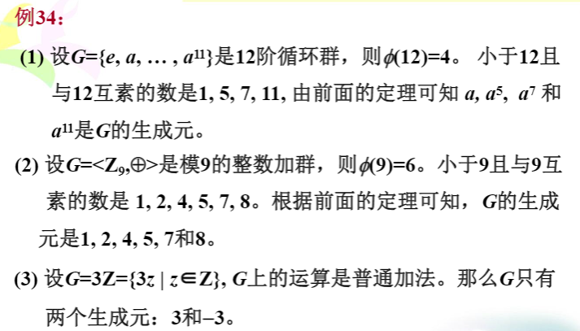

<!--
 * @Author: your name
 * @Date: 2021-05-05 15:11:52
 * @LastEditTime: 2021-05-13 17:50:39
 * @LastEditors: Please set LastEditors
 * @Description: In User Settings Edit
 * @FilePath: \离散数学\离散数学.md
-->
# 离散数学

## 第四章 函数
***
### 函数的基本概念

定义：
> - 1. 设f是集合$X$到$Y$的一个二元关系，如果对每个$x∈X$，都有唯一的$y∈Y$，使得$<x,y>$$∈f$，则称f是X到Y的函数，记作$f$：$X->Y$
> - 注： $X$:前域； $Y$：陪域; $x$: 原像； $y$：像;$<x,y>$∈$f$  $<=>$  $y=f(x)$
***
> - 2. 称$A$上的恒等关系$I_A$ 为$A$上的恒等函数,对所有的x∈A都有 $I_A(x)=x$。
***
> - 3. 设$f$：$X->Y$，$g$：$A->B$，则$f=g$的充要条件是
> 1. $X=A$;
> 2. $Y=B$;
> 3. 对$\forall$$x$∈$X$,$f(x)$=$g(x)$。三者缺一不可

> 记：$Y^X$={$f$|$f$：$X$->$Y$}，表示X到Y的所有不同函数的集合。若|$X$|=$m$,|$Y$|=$n$,则|$YX$|=$nm$。
***

***

### 函数的性质

定义：
> - 1. $f$：$X->Y$，
> - - 若X中不同的元素有不同的像，即对$\forall$$x_1$，$x2$∈$X$,若$x_1$≠$x_2$则$f$($x_1$)≠$f$($x_2$)，称f为单射函数（也叫内射函数)；
> - -  若对$\forall$$y$∈$X$，均有$x$∈$X$，使$f(x)=y$，则称f为满射函数；
> - - 若f既是单射函数又是满射函数，则称为双射函数。
***
定理：
> - 当X和Y均为有限集时，$f$：$X$->$Y$,
> - 1. $f$为单射函数的必要条件是：$|X|$≤$|Y|$；
> - 2. $f$为满射函数的必要条件是：$|Y|$≤$|X|$;
> - 3. $f$为双射函数的必要条件是：$|X|$=$|Y|$。
***

***

### 函数的运算
#### 函数的符合运算
定理：
> - 1. 设 $f$：$X$->$Y$ , $g$：$Y$->$Z$, 则 $f$ 和 $g$ 进行关系合成后得到
一个新关系 $f$ 。 $g$ 是X到Z的函数。
> - 注：设 $f$：$X$->$Y$ , $g$：$Y$->$Z$, 则 $f$ 和 $g$ 进行关系合成后得到函数一
般记为： $g$。$f$=$g$($f$($x$))。
***
> - 2. 设$f$, $g$,$h$为函数, 则($f$ 。 $g$) 。 $h$ 和 $f$ 。 ($g$ 。 $h$)都是函数, 且($f$ 。 $g$) 。 $h$ = $f$ 。 ($g$ 。 $h$)
***
> - 3. 设 f：$X$->$Y$ , g：$Y$->$Z$, 则:
> - - - 若 $f$ 和 $g$ 都是单射，则 $g$ 。 $f$ 也是单射；
> - - - 若 $f$ 和 $g$ 都是满射，则 $g$ 。 $f$ 也是满射； 
> - - - 若 $f$ 和 $g$ 都是双射，则 $g$ 。 $f$ 也是双射。
***
> - 4. 设 f：$X$->$Y$ , g：$Y$->$Z$, 则:
> - - - 若 g 。 f 是单射，则 f 是单射 ；
> - - - 若 g 。 f 是满射，则 g是满射；
> - - - 若 g 。 f 是双射，则 f 是单射 , g是满射 。
***
> - 5. 设 $f$：$X$->$Y$ 是双射函数，则$f$的逆关系 $f^{-1}$ 是Y到X的函
数, 且 $f^{-1}$是双射函数。
*** 
> - 6. 设 X, Y, Z是三个集合， f：$X$->$Y$ , g：$Y$->$Z$, 都是可逆的，
则 $g$ 。 $f$ 也是可逆的，且 (g。f)^{-1} = $f^{-1}$ 。 $g^{-1}$。
***
> - 7.  - 设 $f$ : $A$→$B$是可逆的, 则 $f^{-1}$。f = $I_B$, f 。$f^{-1}$ = $I_A$
>     - -  对于双射函数 $f$: $A$→$A$, 有 $f^{-1}$ 。 $f$ = $f$ 。 $f ^{-1}$ =$I_A$
***

***
### 置换
定义：
> - 集合A上的一个双射函数，称作A上的一个置换。
注：
> - 若|A| = n， 则A上不同的置换的个数为n!。
> - 一个置换的逆仍然是一个置换。例如： ${P_5}^{-1}$ = $P_4$
> - 两个置换的合成仍然是一个置换，即置换对关系的合成运算是封闭的。

***

## 无限集合
***
### 集合等势及其性质

定义：1.`对集合A和B，设f：A->B是双射函数，则称A和B等势，记作：A~B。`

定理：1.`集合之间的等势关系~是等价关系。`

### 可数无限集合

定义：`一个集合A如果与自然数集N等势，则称A为可数无限集,其势记为`$\varkappa_0$ 

定理：
1. `任一无限集合必包含一可数无限子集。`
2. `设A为可数无限集，B为有限集，且A∩B=Ø，则AUB为可数无限集。`
3. `设集合A和集合B均为可数无限集，且A∩B=Ø，则AUB为可数无限集。`
4. `可数个可数无限集的并集仍然是可数无限集。`
5. `所有的正有理数组成的集合为可数无限集。`

### 不可数集

定理：
1. `（0,1)是不可数集,其势记为`$\varkappa_1$
2. `对任意的集合A,|A|<|`$2^A$`|`  

***

## 抽象代数

***

### 代数结构的基本概念

#### 代数运算

定义：
1. `设S为集合，函数f：SxS->S称为S上的二元运算，简称为二元运算。`
2. `设S为集合，函数f:S→S称为S上的一元运算，简称一元运算。`
注：
`1）S中任何两个元素都可以进行运算，且运算的结果惟一；2）S中任何两个元素的运算结果都属于S，即S对该运算封闭。`

#### 运算性质

定义： 
1. `设*为S上的二元运算,`
       ` (1)若对任意x,y∈S有x*y=y*x,则称*在S上满足交换律；`
       `(2)若对任意x,y,z∈S有(x*y)*z=x*(y*z),则称*在S上满足结合律；`
       `(3)若对任意x∈S有x*x=x,则称*在S上满足幂等律；`
       `(4)若对任意x,y,z∈S有,当x*y=x*z,y*x=z*x时，必有x=y,则称*在S上满足消去律`
2. `设。和*为S上两个不同的二元运算,`
       `(1)若对任意x,y,z∈S有(x*y)z=(xz)∗(yz)，z(x∗y)=(zx)∗(zy),则称对∗满足分配律；`
       `(2)若。和∗都可交换,且对任意x,y∈S有x。(x∗y)=x，x∗(x。y)=x,则称。和∗满足吸收律。`

#### 特殊元素

定义：
1. `设*为S上的二元运算,如果存在`$e_l$`(或`$e_r$)`∈S，使得对任意x∈S都有`$e_l$`*x=x(或x*`$e_r$`=x)，则称`$e_l$`(或`$e_r$`)是S中关于*运算的左(或右)单位元。若e∈S关于*运算既是左单位元又是右单位元，则称e为S上关于*运算的单位元.单位元也叫做幺元。`
   
2. `设*为S上的二元运算如果存在`$z_l$`(或`$z_r$`)∈S，使得对任意x∈S都有：`$z_l$`*x=`$z_l$`(或x*`$z_r$`=`$z_r$`)，则称`$z_l$`(或`$z_r$`)是S中关于*运算的左(或右)零元。若z∈S关于*运算既是左零元又是右零元，则称z为S上关于运算*的零元。`
   
3. `设*为S上的二元运算,令e为S中关于运算*的单位元,对于x∈S，如果存在`$(x_l)^{-1}$`(或`$(x_r)^{-1}$`∈S使得`$(x_l)^{-1}$`*x=e（或x*`$(x_r)^{-1}$`=e）,则称` $(x_l)^{-1}$`(或`$(x_r)^{-1}$`是x的左逆元（或右逆元）。关于*运算，若存在`  $x^{-1}$ `∈S既是x的左逆元又是x的右逆元，则称` $x^{-1}$ `为x的逆元。如果x的逆元存在，就称x是可逆的。`

定理：
1. `设*为S上的二元运算，`$e_l$`和`$e_r$`分别为S中关于运算的左和右单位元，则`$e_l$`=`$e_r$`=e为S上关于*运算的唯一的单位元。`
2. `设*为S上的二元运算，`$z_l$`和`$z_r$`分别为S中关于运算的左和右零元，则`$z_l$`=`$z_r$`=z为S上关于*运算的唯一的零元。`
3. `设*为S上可结合的二元运算,e为该运算的单位元,对于x∈S如果存在左逆元`$(x_l)^{-1}$`和右逆元`$(x_r)^{-1}$`,则有`$(x_r)^{-1}$`=`$(x_l)^{-1}$`=`$x^{-1}$`,且`$x^{-1}$`是x的惟一的逆元。`

#### 代数结构
定义：
   1. `非空集合S和S上k个代数运算`$f_1$`,`$f_2$`,...,`$f_k$`组成的系统称为代数系统,简称代数，记做<S,`$f_1$`,`$f_2$`,...,`$f_k$`>。`
   2. `设V=<S,`$f_1$`,`$f_2$`,...,`$f_k$`>是代数系统，B是S的非空子集，如果B对`$f_1$`,`$f_2$`,...,`$f_k$`都是封闭的，且B和S含有相同的代数常数，则称<B,`$f_1$`,`$f_2$`,...,`$f_k$`>是V的子代数系统，简称子代数。`
说明：
   1. `子代数和原代数是同种的代数系统；`
   2. `对于任何代数系统V=<S,`$f_1$`,`$f_2$`,...,`$f_k$`>，其子代数一定存在；` 
   3. `最大的子代数：就是V本身；`
   4. `最小的子代数：如果令V中所有代数常数构成的集合是B，且B对V中所有的运算都是封闭的，则B就构成了V的最小的子代数；`
   5. `大和最小的子代数称为V的平凡的子代数`
   6. `若B是S的真子集，则B构成的子代数称为V的真子代数。`

***

### 半群

定义：
1. `(1)设V=<S,*>是代数系统，*为二元运算，如果*运算是可结合的，则称V为半群；`
 `(2)设V=<S,*>是半群，若e∈S是关于*运算的单位元，则称V是含幺半群，也叫做独异点。有时也将独异点V记作V=<S,*,e>。`
2. `设<S,*,e>是一个独异点（含幺半群），如果存在g∈S，使得对任意的a∈S，都有a=g*g*...*g=`$g^h$`(h∈N),则称<S,*,e>为循环独异点，g为生成元。`

***
### 同态和同构

定义：
1. `(1)如果两个代数系统中运算的个数相同，对应运算的元数相同，且代数常数的个数也相同，则称它们是同类型的代数系统。`
   `(2)如果两个同类型的代数系统规定的运算性质也相同，则称为同种的代数系统。`
2. `设V1=<A,∘>和V2=<B,*>是同类型的代数系统，f:A->B，且`$\forall x$`,y∈A有f(x∘y)=f(x)*f(y),则称f是V1到V2的同态映射，简称同态。`
3. `(1)f如果是单射，则称为单同态；`
   `(2)如果是满射，则称为满同态，这时称V2是V1的同态像；`
   `(3)如果是双射，则称为同构，也称代数系统V1同构于V2；`
   `(4)如果V1=V2，则称作自同态。`

性质：
1. 设代数系统`<X,*>`和`<Y,∘>`同构，g是同构映射，则:
   1）若*在X上可结合，则∘在Y上也可结合；
   2）若*在X上可交换，则∘在Y上也可交换；
   3）若`<X,*>`有单位元$e_x$，则`<Y,∘>`也有单位元$e_y$，且$e_y$=g($e_x$)；
   4）若`<X,*>`有零元$z_x$,则`<Y,∘>`也有零元$z_y$，且$z_y$=g($z_x$)；
   5）若`<X,*>`关于元素a有逆元$a^{-1}$,`<Y,∘>`关于b有逆元$b^{-1}$，则若g(a)=b,则$b^{-1}$=g($a^{-1}$)。

***
### 同余关系

定义：
1. 设~是A=`<S,*,Δ>`的载体S上的等价关系，任取a,b,c∈S
   (1)当a ~ b时，若ac ~ bc,ca ~ cb,则称 ~ 是关于运算*的同余关系；
   (2)当a ~ b时，若Δa ~ Δb,则称关系 ~ 是关于运算Δ的同余关系。
2. `<S,*,Δ>`上的等价关系 ~ ，如果 ~ 在S上的每个运算下都具有置换性质，则称 ~ 是S上的同余关系。
3. 设g是A=`<S,*>`到A'=`<S,*'>`的一个同态，g:S→S'可诱导出一个S上的自然等价关系，这一关系定义为：a,b∈S,a ~ b当且仅当g(a)=g(b)。
   

定理:
1. 等价关系  ~  关于二元运算*是同余关系的充要条件是当a ~ b,c ~ d时有，ac ~ bd。
2. 设g是从代数系统A=`<S,*,Δ>`到代数系统A'=`<S',*',Δ'>`的同态映射，如果在A上定义二元关系R为：a ~ b,当且仅当g(a)=g(b)，则 ~ 为A上的一个同余关系。
   
一个同态可以诱导出一个同余关系，反之亦然。

运算上的同余关系:等价关系在运算下的可保持性是指参与运算的对应元素，如果在同一个等价类中，则运算后的结果也必在同一个等价类中。
代数系统上的同余关系:等价关系 ~ 若果在代数系统A的所有运算下都是可保持的，则 ~ 是A上的同余关系。同余关系使得元素所在的等价类在运算上可作为一个整体来考虑。

***

### 商代数、积代数

#### 商代数
定义：
1. 设A=`<S,*,Δ,k>`是一个代数系统， ~  是A上的同余关系，A关于  ~  的商代数A/~=`<S/~,*',Δ',[k]>`,其中，Δ'[a]=[Δa],[a]*'[b]=[a *b]S/ ~ 表示S关于等价关系~的商集。
性质：
1）代数A中如果运算*是可交换的，则A/ ~ 上的运算*'也是可交换的；
2）代数A中如果运算*是可结合的，则A/ ~ 上的运算*'也是可结合的；
3）如果k是代数A中关于运算*的单位元，则[k]也是A/ ~ 上关于运算*'的单位元；
4）如果k是代数A中关于运算*的零元，则[k]也是A/ ~ 上关于运算*'的零元。

定理：
1. 如果~是代数A=`<S,*,Δ,k>`上的同余关系，那么规范映射h:S→S/ ~ ,h(a)=[a](a∈S)是从A到商代数A/ ~ =`<S/ ~ ,*',Δ',[k]>`的同态映射，称为与 ~ 相关的自然同态。
2. 设f是从代数A=`<S,*,Δ,k>`到A'=`<S',*',Δ',k'>`的同态， ~ 是A上由f诱导出的同余关系，那么从商代数A/ ~ =`<S/~,*'',Δ'',[k]>`到`<f(S),*',Δ',k'>`存在同构。

#### 积代数
定义：
1. 设A=`<S,*,Δ,k>`和A'=`<S',*',Δ',k'>`是两个同类型的代数系统，则A和A'的积代数定义为：V=`<SxS',*'',Δ'',k''>`,其中：SxS'={`<a,a'>`|a∈S,a'S'},任取`<a,c>`∈SxS',`<b,d>`∈SxS',`<a,c>`*''`<b,d>`=`<a*c,b*'d>`,Δ''(`<a,c>`)=<Δa,Δ'b>,k''=`<k,k'>`。
   
性质：
设V1=`<A,◦>`和V2=`<B,*>`是同类型的代数系统，V1xV2=`<AxB,▪>`是它们的积代数,则：
(1)如果◦和*运算是可交换（可结合、幂等）的，那么▪运算也是可交换（可结合、幂等）的；
(2)如果$e_1$和$e_2$（$\theta_1$和$\theta_2$）分别为◦和*运算的单位元（零元），那么<$e_1$,$e_2$>（$\theta_1$和$\theta_2$）也是▪运算的单位元（零元）。
(3)如果x和y分别为◦和*运算的可逆元素，那么`<x,y>`也是▪运算的可逆元素，其逆元就是<$x^{-1}$,$y^{-1}$>

***

### 群
定义：
1. 设V=`<S,*>`是独异点，e∈S关于*运算的单位元，若$\forall$a∈S，$a^{-1}$∈S，则称V是群，通常将群记作G。
2. 若群G是有穷集，则称G是有限群，否则称为无限群。群G的基数称为群G的阶，有限群G的阶记作|G|。
3. 只含单位元的群称为平凡群。
4. 若群G中的二元运算是可交换的，则称G为交换群或阿贝尔(Abel)群。
5. 设G是群，a∈G，使得等式$a^k$=e成立的最小正整数k称为a的阶，记作|a|=k，称a为k阶元。若不存在这样的正整数k，则称a为无限阶元。
6. 设X是一非空集合(|X|=n)，X上的所有置换关于关系的合成运算构成的群称为X上的对称群，记为Sn。Sn的某个子群称为X上的置换群。
7. 设G是群，若存在a∈G使得G={$a^k$|k∈Z}，则称G是循环群，记作`G=<a>`，称a为G的生成元。
8. 循环群的分类：n阶循环群和无限循环群。设G=`<a>`是循环群，若a是n阶元，则：G={$a^0=e,a_1,a_2,...,a_{n-1}$}那么|G|=n，称G为n阶循环群。若a是无限阶元，则G={$a^0=e,a_1,a_2,...a_{n-1}$}称G为无限循环群。
9. 设G是群，H是G的非空子集，
    - 如果H关于G中的运算构成群，则称H是G的子群;
    - 若H是G的子群，且H$\subset$G，则称H是G的真子群。
10. 设H是G的子群，a∈G。集合aH={ah|h∈H}，称为元素a所确定的子群H的左陪集；Ha={ha|h∈H}为子群H在G中的右陪集，称a陪集的代表元素。
11. 设H是G的子群，若对任意的a∈G，都有aH=Ha，则称H是G的正规子群。
    - 注1：aH=Ha，并不意味着对任意的a∈G，都有a*h=h*a，则这里强调的是*运算所组成的元素的集合；
    - 注2：若G是交换群，则G的每个子群都是正规子群；反之由aH=Ha，并不能说明元素a与H中的每个元素都可交换；
    - 注3：一般的群G至少有两个正规子群，一个是的最小子群{e}，一个是G的最大子群G自身，这两个子群称为平凡的正规子群。
12. 设H是G的正规子群，则G关于~的商集记作G/H，即由H的陪集构成的集合，并且 ~ 是上的同余关系。定义G/H上的运算ʘ如下：HaʘHb=H(a*b)a,b∈G于是：`<G/H,ʘ>`是一个群，称为G关于正规子群H的商群。

   
定理:
1. 设G为群，则G中的运算满足：
   - $\forall$ a∈G，($a^{-1})^{-1}$=a；
   - $\forall$ a,b∈G，$(ab)^{-1}$=$b^{-1}a^{-1}$；
   - $\forall$ a∈G，$a^na^m$=$a^{n+m}$，n,m∈Z；
   - $\forall$ a∈G，$(a^n)^m$=$a^{nm}$，n,m∈Z；
   - 若G为交换群，则$(ab)^n$=$a^nb^n$。
2. 设G为群，$\forall$ a,b∈G，方程ax=b和ya=b在G中有解且仅有唯一解。
3. 设G为群，则G中适合消去律，即对任意a,b,c∈G有
   - 若ab=ac，则b=c；
   - 若ba=ca，则b=c。
4. 设G为群，a∈G且|a|=r.设k是整数，则：
   - $a^k$=e当且仅当r|k；
   - $|az^{-1}|$=|a|；
   - r≤|G|。
5. 每个n阶有限群都同构于一个n次置换群。
6. 设G=`<a>`是循环群.
   - 若G是无限循环群，则G只有两个生成元，即a和$a^{-1}；
   - 若G是n阶循环群，则G含有$\Phi$ (n)个生成元，对于任何小于n且与n互质的数r∈{0,1,...,n-1},$a^r$是G的生成元。
   - 其中：$\Phi$ (n)称为欧拉函数，表示小于或等于n且与n互素的正整数的个数。例如n=12，小于或等于12且与12互素的正整数有4个：
  1,5,7,11，所以$\Phi$(12)=4。
7. 任一无限阶循环群都与整数加群同构；任一有限阶群都与1的n次单位根群同构。
8. 设G=`<a>`是循环群，则：
   - 设G=`<a>`是循环群，则G的子群仍是循环群；
   - 若G=`<a>`是无限循环群，则G的子群除{e}以外都是无限循环群；
   - 若G=`<a>`是n阶循环群，则对n的每个正因子d，G恰好含有一个d阶子群。
9. 设G为群，H是G的非空子集，则H是G的子群当且仅当
    - $\forall$ a,b∈H有ab∈H;
    - $\forall$ a∈H有$a^{-1}$∈H。
10. 设G为群，H是G的非空子集。H是G的子群当且仅当$\forall$ a,b∈H有$ab^{-1}$∈H。
11. 设G为群，H是G的非空有穷子集，则H是G的子群当且仅当$\forall$ a,b∈H有ab∈H。
12. 设G为群，a∈G，令H={$a^k$|k∈Z}，则H是G的子群，称为由a生成的子群，记作`<a>`。
13. 设G为群,令:C={a|a∈G∧$\forall$ x∈G(ax=xa)}，则C是G的子群，称为G的中心。
14. 设H是群G的子群，则：
    - He=H；
    - $\forall$ a∈G有a∈Ha。
15. H是群G的子群，则$\forall$ a,b∈G有：a∈Hb $\Leftrightarrow$ $ab^{-1}$∈H $\Leftrightarrow$ Ha=Hb
16. 设H是群G的子群，在G上定义二元关系R：$\forall$ a,b∈G,`<a,b>`∈R $\nLeftrightarrow$ $ab^{-1}$∈H则R是G上的等价关系，且$[a]_R$=Ha。
17. 设H是群G的子群,则
    - $\forall$ a,b∈G，Ha=Hb或Ha∩Hb=$\oslash$；
    - ∪{Ha|a∈G}=G。
18. 设G是有限群，H是G的子群，则`|G|=|H|·[G:H]`,其中`[G:H]`是H在G中的不同右陪集(或左陪集)数，称为H在G中的指数。
19. 设G是n阶群，则$\forall$a∈G，|a|是n的因子，且有$a^n$=e。
20. 对阶为素数的群G，必存在a∈G使得`G=<a>`。(一个质数阶的群必定是循环群，且任一与幺元不同的元素都是生成元）
21. 如果群G只含1阶和2阶元，则G是Abel群。
22. 群`<G,*>`的一个子群H是正规子群的充要条件是：对任意的g∈G，都有$gHg^{-1}=H$。
23. 群`<G,*>`的一个子群H是正规子群的充要条件是：对任意的g∈G，h∈H都有$gHg^{-1}∈H$。
24. 群`<G,*>`的正规子群H的不同陪集都是G的同余类。
25. 任意一个群`<G,*>`的商群`<G/H,ʘ>`都是`<G,*>`的满同态像。

***

### 环和域
